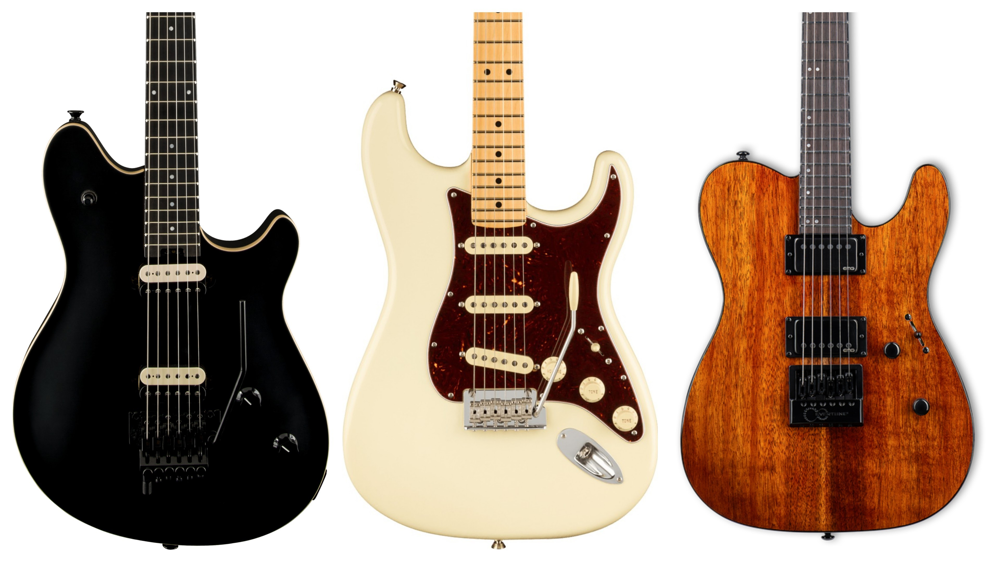

# Guitars

## Owned

- [Greg Bennett **Torino (TR4)**](https://gregbennettguitars.com/guitars/electric/vintage/tr4/)

### Family

My dad has a couple that I learned to play on:

- [Sigma/Martin **DM-3**](https://www.sigma-guitars.com/acoustic-guitars/st-series/dm-st/)
- [Hohner **Les Paul (L59T)**](https://reverb.com/item/49089724-hohner-l59t-tobacco-burst-w-hsc)

And recently got a new one:

- [Gretsch **Electromatic (G5622T)** Center Block (Speyside)](https://www.sweetwater.com/store/detail/G5622TESS--gretsch-g5622t-electromatic-center-block-double-cut-electric-guitar-speyside)

## Wishlist

### Short Term

From left to right:

- [EVH **Wolfgang** Special (Stealth Black with Ebony Fingerboard)](https://www.sweetwater.com/store/detail/WolfSp2St--evh-wolfgang-special-stealth-black-with-ebony-fingerboard)
- [Fender American Professional II **Stratocaster** (Olympic White with Maple Fingerboard)](https://www.sweetwater.com/store/detail/StratAP2MOW--fender-american-professional-ii-stratocaster-olympic-white-with-maple-fingerboard)
- [ESP LTD **TE-10000** EverTune (Mahogany/Koa with Ebony Fingerboard)](https://www.sweetwater.com/store/detail/LTE1KETKNG--esp-ltd-te-1000-evertune-koa-electric-guitar-natural-gloss)

### Long Term

- [Ernie Ball Music Man **Sabre** (Blue Moonstone with Ebony Fingerboard)](https://www.sweetwater.com/store/detail/SabreDBB)
- [Gretsch **Broadkaster** Center Block (Bourbon Stain with Ebony Fingerboard)](https://www.gretschguitars.com/gear/build/center-block/g6609tfm-players-edition-broadkaster-center-block-double-cut-with-string-thru-bigsby-and-flame-maple/2400700878)
