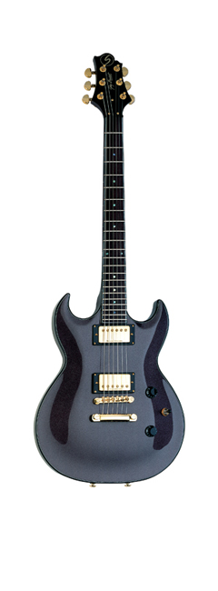
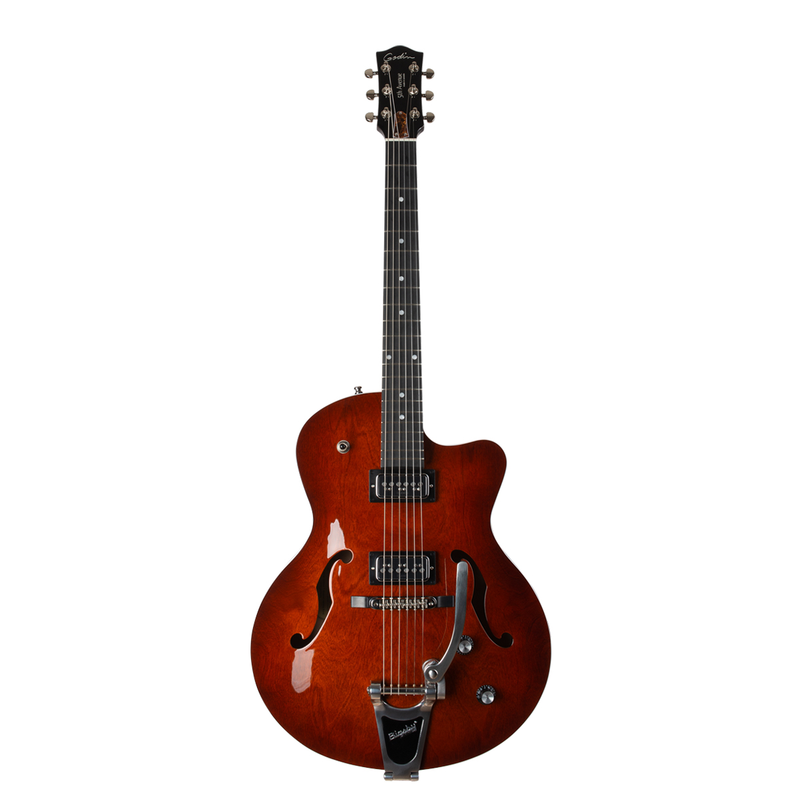
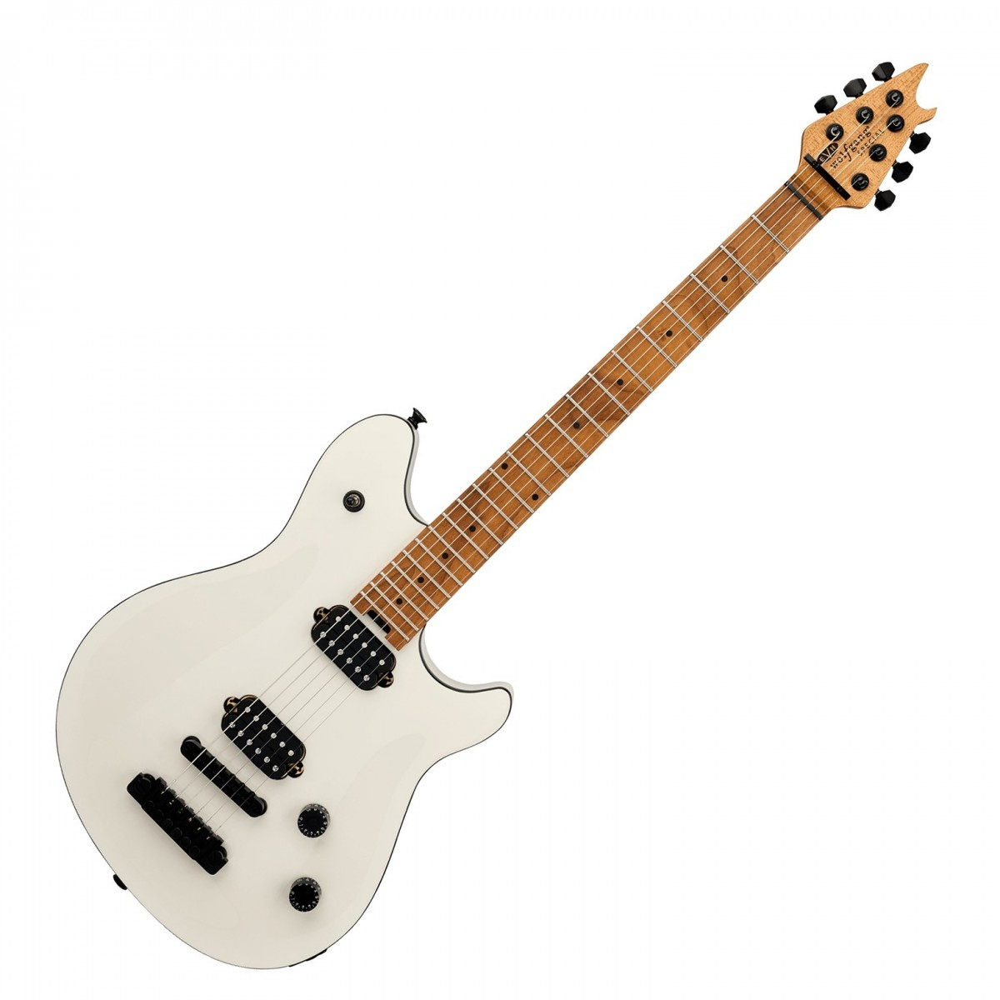

# Guitars

## Owned

[Greg Bennett **Torino TR4** (Metallic Black/Rosewood)](https://gregbennettguitars.com/guitars/electric/vintage/tr4/)
- This was my first guitar (outside those [my Dad let me borrow](#family)).
- I learned how to play rock, jazz, and metal on this guitar, and I traveled with it when playing in high school combo and jazz band.
- Although pretty banged up, it's still a lot of fun to play, and I hope to fix it up one day with new paint and pickups.

[Godin **5th Avenue** Uptown T-Armond (Havana Burst/Richlite)](https://godinguitars.com/product/5th-ave-uptown-t-armond-havana-burst)
- This guitar got me back into playing in early 2025
- I've been learning how to play neo-soul (r&b/blues) style on this guitar
- I never thought I'd use a whammy bar, but I really like the Bigsby

[EVH **Wolfgang Special TOM** (Husk White/Baked Maple)](https://www.evhgear.com/gear/shape/wolfgang/evh-wolfgang-special-baked-maple-tom/5107707512)
- Gifted to me by my wife on my 30th birthday
- I first played a Wolgang Special at Linda's Music Store in Decatur, IL, and it always stood out as one of the easiest-to-play fingerboards I've used.
- As I don't use a whammy bar and can quickly tune to drop-D, as needed, I waited for the TOM (tune-o-matic) model to release in 2025.

### Family

My dad has a couple that I learned to play on:

- [Sigma **DM-3** (Satin/Micarta)](https://www.sigma-guitars.com/acoustic-guitars/st-series/dm-st/)

[Hohner **Les Paul (L59T)** (Flamed Maple/Mahogany)](https://reverb.com/item/49089724-hohner-l59t-tobacco-burst-w-hsc)
- Easily the heaviest guitar I've ever played, but it looks great, and I think can probably produce some great sound with all that weight and the right equipment
- Features a super tremolo bridge, which is literally and metaphorically a huge pain

And recently got a new one:

- [Gretsch **Electromatic (G5622T)** Center Block (Speyside with Laurel Fingerboard)](https://www.gretschguitars.com/gear/build/center-block/g5622t-electromatic-center-block-double-cut-with-bigsby/2508300542)

## Wishlist

- [ESP **E-II Eclipse** (Mahogany/Koa with Ebony Fingerboard)](https://www.espguitars.com/products?categories=eclipse-series-guitars-3)
- [EVH **Wolfgang USA** (Stealth Black with Ebony Fingerboard)](https://www.evhgear.com/gear/shape/wolfgang/wolfgang-usa/5107900868)
- [Fender American Professional II **Stratocaster** (Mystic Surf Green with Maple Fingerboard)](https://www.fender.com/products/american-professional-ii-stratocaster?variant=45940642742494)
- [Music Man **Sabre** (Blue Moonstone with Ebony Fingerboard)](https://www.sweetwater.com/store/detail/SabreDBB)
