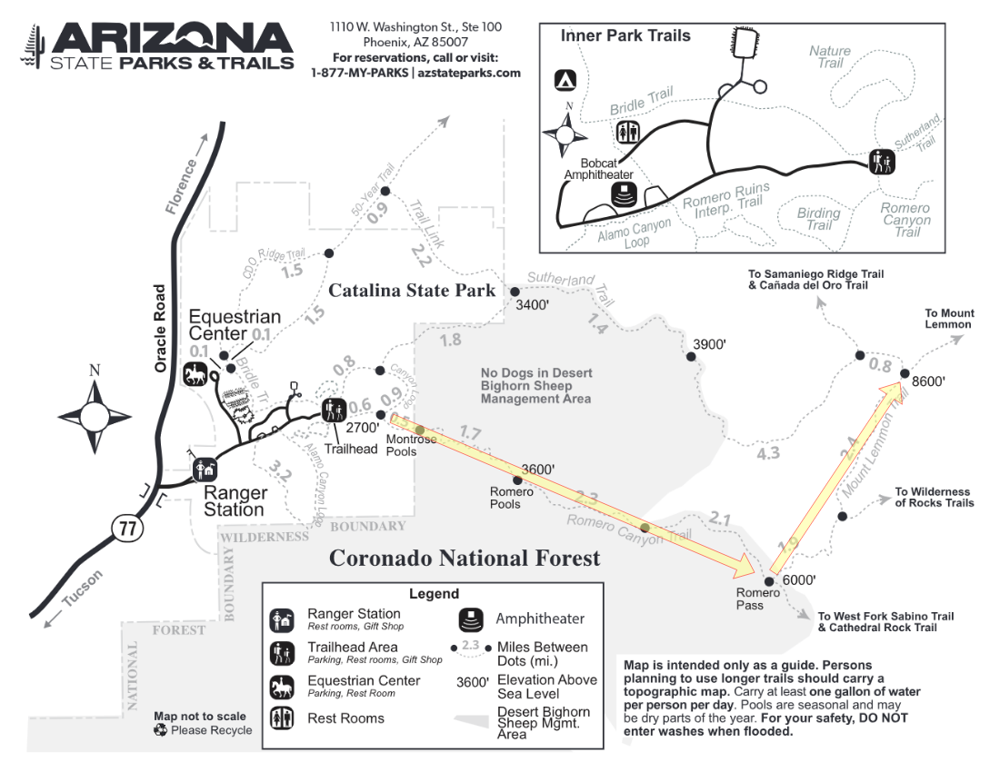

# Romero Canyon

**Goal**: Hike from Catalina State Park to the summit of Mount Lemmon

- [Catalina State Park](https://azstateparks.com/catalina)
    - [Trails](https://azstateparks.com/catalina/things-to-do/trails)
    - [Park Map](https://arizona-content.usedirect.com/storage/20241025170528cata_park-map_10-25-2024.pdf)
    - [Trail Map](https://arizona-content.usedirect.com/storage/Catalina-Trail-Map-2025_1.pdf)

## Summary

[Romero Canyon Trail](https://azstateparks.com/catalina/things-to-do/trails)

_"The Romero Canyon Trail leads to epic destinations like the refreshing waters of Romero Pools. Start from the Main Trailhead parking lot where you’ll cross Sutherland Wash and head northeast for 1.0 mi/1.6 km on an easy walk to the Montrose Pools overlook. Montrose Pools are a series of seasonal pools and waterfalls found throughout Montrose Canyon. The next 1.8 mi/2.9 km of the trail to Romero Pools are difficult. Prepare for a steep, uphill climb through the Pusch Ridge Wilderness on rocky, uneven terrain with 1,000 ft/305 m elevation gain. Seasonal pools and waterfalls can be found throughout Romero Canyon once you reach the creek crossing 2.8 mi/4.5 km east on the trail. Picnicking, water play, and backpacking are all popular activities in the Romero Pools area. Plan on at least 5.6 mi/9.0 km and 4 hours of hiking round-trip from the Main Trailhead to Romero Pools."_

_"To continue to Romero Pass, the trail climbs up another 4.4 mi/7.1 km to Romero Pass at an elevation of 6,000 ft/1,829 m. The Romero Canyon Trail ends at Romero Pass, where it intersects with the Mt. Lemmon Trail (additional 5.9 mi/9.5 km to Mt. Lemmon summit) and West Fork Sabino Trail (additional 13.3 mi/21.4 km to Sabino Canyon parking lot). From the Trailhead to Romero Pass is 7.2 mi/11.6 km with an elevation gain of 3,300 ft/1,000 m and about 10 hours round-trip. The trail is normally unmaintained beyond Romero Pools. Please bring a map, compass, or GPS device to go to Romero Pass to avoid getting lost. Winter (Dec. - Mar.) and summer monsoon rains (Jun. - Sep.) may create seasonal water crossings on the trail."_

### Navigation

[Romero Canyon Trail --> Romero Pass --> Mount Lemmon Trail/Summit](https://www.alltrails.com/trail/us/arizona/romero-canyon-to-mount-lemmon)

- 12.8 mi / 20.5 km
- 6,879 ft

### Communication

[Outdoor Equipment Rentals](https://www.oerentals.com/product/garmin-inreach-rental-messenger/)
- Includes consumer data plan

[Garmin inReach Messenger](https://www.garmin.com/en-US/p/793265/)

- Messaging
- SOS requests
- Location sharing

### Considerations

From [Catalina State Park / Trails](https://azstateparks.com/catalina/things-to-do/trails):

_"Hiking to Romero Pools in temperatures above 95°F/35°C is dangerous and may result in heat-related illnesses that can be fatal in some cases. Bring at least 4-liters of water per person to stay hydrated. There is little to no shade on this trail, so please wear sunscreen and cover your skin. We recommend you start the hike before 6:00 AM from May through October."_

### Restrictions

### Fire

Catalina State Park (Arizona) allows charcoal fires, firelogs, and propane in its campground fire rings, but prohibits wood-burning fires at all times. Camping regulations are documented [here](https://azstateparks.com/catalina/camping-and-rvs/rv-and-tent-camping).

Coronado National Forest fire restrictions and other alerts are monitored [here](https://www.fs.usda.gov/r03/coronado/alerts).

### Other

From [Catalina State Park / Trails](https://azstateparks.com/catalina/things-to-do/trails):

_"Dogs and bicycles are not allowed in the Bighorn Sheep Management Area/Pusch Ridge Wilderness (includes Romero Pools and Montrose Pools) which begins at the Forest Service gate about 1.0 mi/1.6 km east on the Romero Canyon Trail from the Trailhead."_

_"From January 1st to April 30th, traveling more than 400 ft/122 m off Forest Service system trails is prohibited due to the bighorn sheep lambing season. Horses are not recommended past the Montrose Pools overlook due to narrowly laid stairs and tight passages between rocks. More Information on Pusch Ridge Wilderness."_

## Camping

I spoke with a Park Ranger on 09/21/2025. Barring [Bighorn Sheep restrictions](#restrictions), we can camp wherever.

## Supplies

[Google Sheets](https://docs.google.com/spreadsheets/d/1Hb3K4wFChySTPlnPp3iCVQdayy30XoETKk0Vs05x3d0/edit?usp=sharing)
